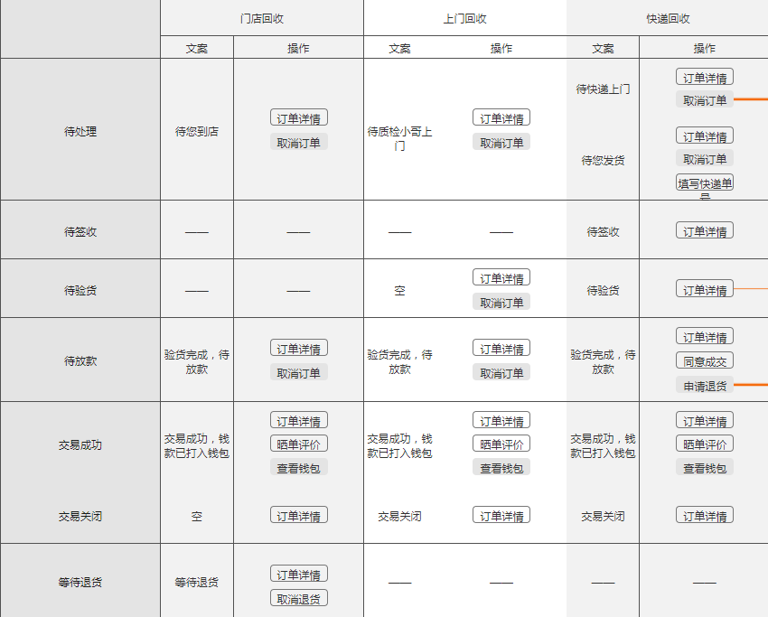

# 订单详情模块

此文档为PC订单详情组件

## 目录结构

```
│── /index.js            # 个人中心主文件，初始化saga、reducer等。
│── /aside.js            # 个人中心左侧导航栏
│── /buttonStatus.js     # 订单状态按钮判断，可供订单列表与订单详情使用
│── /cancelReason.js     # 订单取消原因，可供订单列表与订单详情使用
│ ├── /collection.js     # 订单详情底部收款信息
│ ├── /detail.js         # 订单详情主文件，用户发送Actions，与组织各组件结构
│ ├── /orderStatus.js    # 用于订单详情显示订单状态，包含订单进度组件+各订单文案展示操作
│ ├── /price.js          # 用于展示订单详情底部价格信息
│ ├── /productInfo.js    # 展示当前订单商品信息与用户询价属性
│ ├── /qualityBox.js     # 用于展示当前质检异常弹出窗
│ ├── /qualityCheck.js   # 用于展示订单质检完成后的质检报告
│ ├── /statusInfo.js     # 用于处理展示当前各个订单状态对应的文案与按钮
│ └── /static            # 订单状态
└── /index.less          # 个人中心的less
```

## 基本信息

* 依赖路由：`/account`

* 页面路由：`/account/order/detail/:orderId`(其中orderId为订单Id)

* [页面UE地址](http://h32fhe.axshare.com/)

## 依赖接口

#### 1. GET [/user/order/detail/{orderno}](http://open.aihuishou.com/doc/swagger/#!/User/UserOrderDetailByOrderNoGet) 订单详情

#### 2. GET [/user/order/inspection/report/{orderno}](http://open.aihuishou.com/doc/swagger/#!/User/UserOrderInspectionReportByOrderNoGet)  质检报告

#### 3. GET [/expresscompany/list](http://open.aihuishou.com/doc/swagger/#!/ExpressCompany/ExpressCompanyListGet)  物流公司列表

#### 4. POST [/user/confirm/deal](http://open.aihuishou.com/doc/swagger/#!/User/UserConfirmDealPost)  确认成交

#### 5. POST [/user/order/deliver](http://open.aihuishou.com/doc/swagger/#!/User/UserOrderDeliverPost)  订单发货

#### 6. GET [/order/cancel/reasons](http://open.aihuishou.com/doc/swagger/#!/Order/OrderCancelReasonsGet)  取消订单原因

#### 7. POST [/user/order/cancel](http://open.aihuishou.com/doc/swagger/#!/User/UserOrderCancelPost)  取消订单


## 依赖类库

- [qrcode.react]() React生成二维码,用于前端生成二维码，评价扫码需要
- [react-swipe]() React Swiper插件，用于前端轮播图，质检报告中异常有图片展示

## 操作按钮状态判断

- 评价晒单：订单状态为`交易成功`并且`当前未评价`

- 查看钱包：订单状态为`交易成功`

- 申请退货：订单状态为`验货失败`并且`未申请退货`，并且`canApplyReturn==true`&&`isApplyReturn==false`

- 退货详情：订单状态为`验货失败`并且`已申请退货`，并且`isApplyReturn==true`

- 确认成交：订单状态为`验货失败`并且交易方式为`快递取货`


## 按钮状态判断图


#### 操作按钮状态判断代码

- 见buttonStatus.js文件


# 订单状态提示文案


### `交易成功统一文案：钱款已打入您的钱包，钱包余额￥XXX`

#### 门店订单 
- 待您到店 ：`列出门店信息与重要提示（显示组件为shopInfo组件）`

- 交易关闭 ：`展示交易关闭的原因，如果没有原因，则为空`

- 待放款   ：`商品的质检报告已出，回收价已更新`

#### 上门订单&地铁取货
- 待上门   :`展示预约地址、预约时间、上门费用等信息`

- 待验货   ：`展示温馨提示：请检查工作人员身份，监督其操作，若发现违规，可终止交易并投诉`


#### 自叫快递
- 待您发货 : `展示收件地址、收件人等提示信息`
- 待签收   ：`完成交易，钱款已打入钱包`
- 验货失败 ：`如果不满足优惠券使用条件：质检差异造成价格变动，不满足优惠券的使用条件，优惠券已退回如果仅仅是价格变动，不涉及优惠券失效或者商品差异，则为空`

#### 帮叫快递(`实际已没有帮叫快递`)
- 待快递取货 :`已为您预约XX快递，快递员会在24小时内联系您`
- 待签收   ：`已发货，等待爱回收签收`
- 验货失败 ：`如果不满足优惠券使用条件：质检差异造成价格变动，不满足优惠券的使用条件，优惠券已退回如果仅仅是价格变动，不涉及优惠券失效或者商品差异，则为空`

# 质检报告
 质检报告分为两种情况`(视觉展示有差异)`：
 
- 1.质检完成后与用户自检为同型号
 
- 2.质检完成后与用户自检非同型号

# 注意事项

- 关于订单推送：订单详情页面涉及到广告推送信息，页面加载成功，判断当前来源，同步至第三方

- 订单提示文字：回收方式对应交易状态可能都有不同的视觉展示，判断有些繁琐

- 与老版C#代码进行页面关联，一些隐藏的逻辑或者后台配置功能可能无法发现，容易出问题

- 优惠券使用：质检完成后可能与当初用户使用优惠券的条件不满足，需展示不同文案


